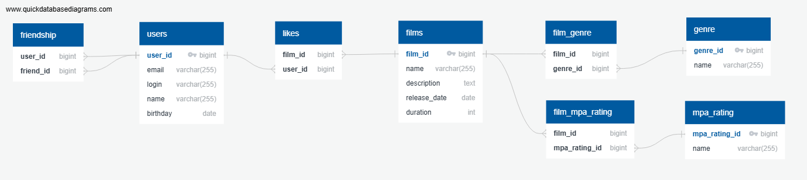

## Схема базы данных

Ниже представлена схема базы данных:



### Пояснение к схеме

Схема базы данных включает следующие основные таблицы:
- `users` — хранит информацию о пользователях.
- `films` — хранит данные о фильмах.
- `genre` и `film_genre` — обеспечивают связь фильмов с жанрами.
- `mpa_rating` и `film_mpa_rating` — связывают фильмы с их рейтингами.
- `likes` — содержит информацию о лайках фильмов пользователями.
- `friendship` — фиксирует отношения дружбы между пользователями.

Каждая таблица связана с другими таблицами через внешние ключи, чтобы поддерживать целостность данных.

## Примеры запросов

### Работа с пользователями (таблица `users`)

1. Добавление пользователя:
   ```
   INSERT INTO users (email, login, name, birthday)
   VALUES ('test@example.com', 'testuser', 'Test User', '2000-01-01');
   ```
2. Обновление данных пользователя:
   ```
   UPDATE users
   SET email = 'new@example.com', login = 'newuser', name = 'New User', birthday = '1995-05-05'
   WHERE user_id = 1;
   ```
3. Получение пользователя по ID:
   ```
   SELECT * FROM users 
   WHERE user_id = 1;
   ```
4. Удаление пользователя:
   ```
   DELETE FROM users 
   WHERE user_id = 1;
   ```
5. Получение всех пользователей:
   ```
   SELECT * FROM users;
   ```
6. Добавление друга:
   ```
   INSERT INTO friendship (user_id, friend_id) 
   VALUES (1, 2);
   ```
7. Удаление друга:
   ```
   DELETE FROM friendship 
   WHERE user_id = 1 AND friend_id = 2;
   ```
### Работа с фильмами (таблица `films`)

1. Добавление фильма:
   ```
   INSERT INTO films (name, description, release_date, duration) 
   VALUES ('Test Film', 'Test Description', '2024-01-01', 120);
   ```
2. Обновление фильма:
   ```
   UPDATE films 
   SET name = 'Updated Film', description = 'Updated Description', release_date = '2024-06-01', duration = 150
   WHERE film_id = 1;
   ```
3. Получение фильма по ID:
   ```
   SELECT * FROM films 
   WHERE film_id = 1;
   ```
4. Удаление фильма:
   ```
   DELETE FROM films 
   WHERE film_id = 1;
   ```
5. Получение всех фильмов:
   ```
   SELECT * FROM films;
   ```
6. Добавление MPA к фильму:
   ```
   INSERT INTO film_mpa_rating (film_id, mpa_rating_id) 
   VALUES (1, 3);
   ```
7. Добавление жанра к фильму:
   ```
   INSERT INTO film_genre (film_id, genre_id) 
   VALUES (1, 2);
   ```
8. Добавление лайка:
   ```
   INSERT INTO likes (film_id, user_id) 
   VALUES (1, 1);
   ```
9. Удаление лайка:
   ```
   DELETE FROM likes 
   WHERE film_id = 1 AND user_id = 1;
   ```

### Работа с рейтингами MPA (таблица `mpa_rating`)

1. Получение всех рейтингов MPA:
   ```
   SELECT * FROM mpa_rating;
   ```
2. Получение рейтинга MPA по ID:
   ```
   SELECT * FROM mpa_rating 
   WHERE mpa_rating_id = 3;
   ```

### Работа с жанрами (таблица `genre`)

1. Получение всех жанров:
   ```
   SELECT * FROM genre;
   ```
2. Получение жанра по ID:
   ```
   SELECT * FROM genre 
   WHERE genre_id = 2;
   ```


